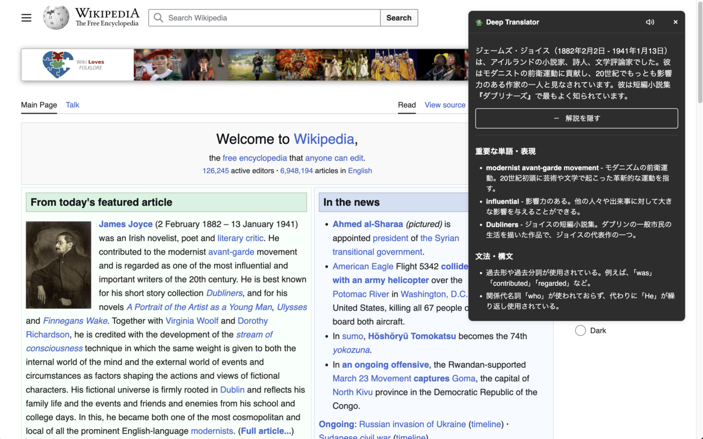

# Deep Translator

## 概要

Deep TranslatorはChatGPT APIを活用した高機能な翻訳ツールです。右クリックメニューやダブルクリック、キーボードショートカットなど、複数の方法で簡単に翻訳を開始できます。

特徴的なのは、単なる翻訳だけでなく、重要な単語や表現の詳細な解説機能を備えていることです。翻訳結果と共に、言い回しの違いや文化的な背景も理解できるため、語学学習のサポートツールとしても活用できます。

## 主な機能

- 🌐 ChatGPT APIによる高精度な翻訳
- 📚 重要な単語や表現の詳細な解説
- 🎯 複数の翻訳起動方法（右クリック、ダブルクリック、ショートカット）
- 🔊 原文の音声読み上げ機能
- 🌙 ダークモード対応

## インストール方法

1. このリポジトリをクローンまたはダウンロード
2. Chrome拡張機能の管理ページ（chrome://extensions/）を開く
3. 「パッケージ化されていない拡張機能を読み込む」をクリック
4. ダウンロードしたフォルダを選択

## 使い方

1. 拡張機能のオプションページでOpenAI APIキーを設定
2. 翻訳したいテキストを選択し、以下のいずれかの方法で翻訳を実行：
   - テキストを右クリックして「ChatGPTで翻訳する」を選択
   - テキストをダブルクリック（設定で有効化が必要）
   - キーボードショートカット（Ctrl+Shift+1 / Command+Shift+1）

## カスタマイズ

オプションページで以下の設定が可能です：
- OpenAI APIキーの設定
- 翻訳モデルの選択（GPT-4o-mini、GPT-4、GPT-3.5 Turbo）
- ダブルクリック翻訳の有効/無効

## ライセンス

MIT License

## 開発者向け情報

プロジェクトの構成：

